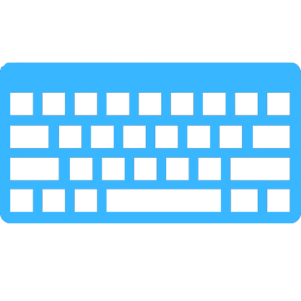

# anuragwagh.github.io
<html>
<head></head>

 <body>
    

        
 
            
 
             
<b>Anurag Wagh</b>

             
Artist

        

        
 
           <h1>about me</h1>
           
20 years /  Artist  / Solopreneur / Computer Engg.

           
Aspiring computer engineer with a creative mind and a passion for creating art  
           	and design that attracts and likes people.. And a solopreneur with tough words and a  
           	complete commitment to changing the thought. 
             

           

           <h2 >What I Do</h2>

           <table width="80%" height="236" border="0" cellpadding="1" cellspacing="1" bgcolor="white" margin-left="10px" style=" margin-left:40px;" id="t1">
<tr>
    <td height="62" align="center" valign="top" id="t1">

        <table width="850"  cellspacing="0" cellpadding="4"id="t1" >

            <tr align="left" id="t1">
                <td valign="top" id="t1" width="300">
                	
                    
Write Blog

                     
                          I like to share my thoughts through  writing blogs & article.
                    
                
                <td valign="top" id="t1">
                	
                    
Design

                     
                          Designing the poster,social media post,logo.
                    
            </tr>

            <tr align="left" id="t1">

                <td valign="top" id="t1" >
                	 
                	 
                	 
Video Creator

                    
                       Like to create video on learning stuffs.
                    
                       

                </td>

                <td valign="top" id="t1">
                	 
                	
                	
Programmer

                    
                          Good at Front-end developing , python,cpp. 
                    
                       
                </td>
            </tr>
        </table>
    </td>
</tr>
</table>

<a class="i6">anuragd230@gmail.com</a>

 

 

 </body>
</html>
